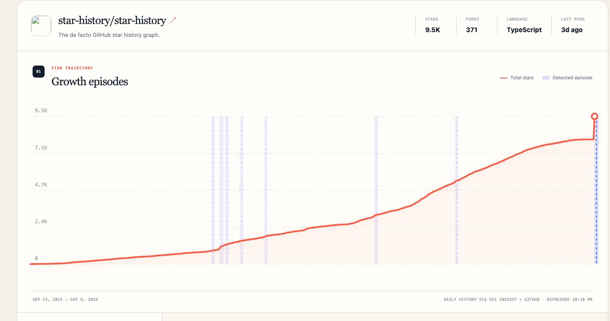
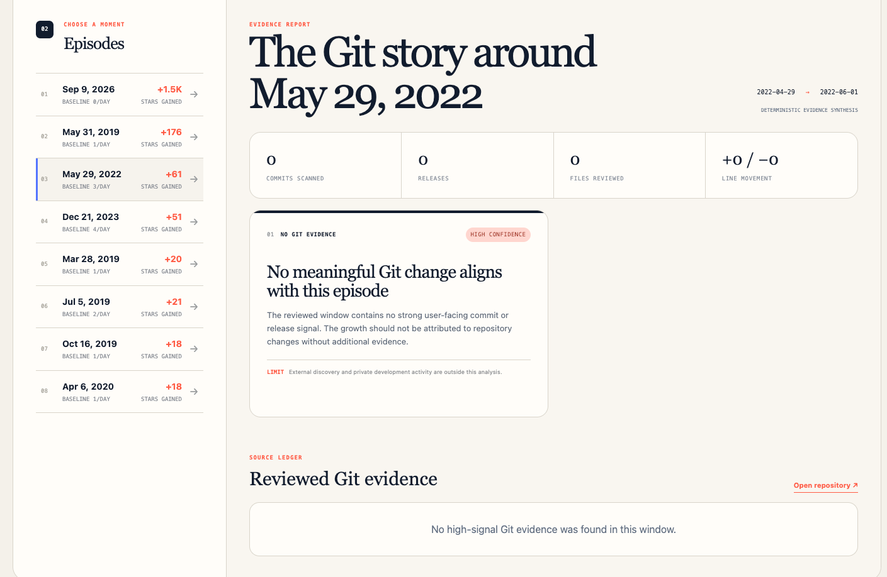

# GitHighlights

[English](README.md) | [简体中文](README.zh-CN.md)

[Live Demo](https://wsmykm3.github.io/gitHighlights/)

> Read the code behind the curve.

GitHighlights is a public-repository intelligence tool that connects unusual
GitHub star-growth episodes with the commits and releases that preceded them.
It helps maintainers, contributors, and curious developers move from **when a
repository accelerated** to **what changed around that moment**—without
mistaking correlation for causation.

Enter any public GitHub repository as `owner/repository` or paste its GitHub
URL. GitHighlights reconstructs the repository's star history, detects
statistically unusual growth periods, and builds an evidence-backed report for
the episode you choose.

## What it does

- Reconstructs and normalizes cumulative star history using OSS Insight and
  GitHub data.
- Detects growth episodes relative to each repository's own historical
  baseline.
- Lets you select an episode directly from the chart or a ranked event list.
- Switches the complete interface and generated analysis between English and
  Simplified Chinese.
- Reviews nearby commits, releases, changed files, and code churn.
- Groups evidence into themes such as product capability, onboarding, API/CLI,
  architecture, performance, compatibility, documentation, distribution, and
  maintenance.
- Labels findings by confidence and links them back to the underlying GitHub
  evidence.
- Explicitly reports when no meaningful Git evidence is present instead of
  inventing an explanation.

## Product tour

### 1. Start with a public repository

Paste a GitHub URL or enter an `owner/repository` pair. The focused landing page
also includes a few example repositories for a quick first run.


### 2. Find the moments when growth accelerated

The star-trajectory view overlays detected growth episodes on the cumulative
history. Repository metadata and ranked episodes provide context, while each
highlighted region can be selected for a closer investigation.



### 3. Investigate the Git activity around an episode

Choose a growth episode to review its evidence window. GitHighlights summarizes
the commits, releases, changed files, and line movement it found, then presents
cautious findings with confidence levels and links to the source evidence. If
the repository history does not support an explanation, the report says so.



## How the analysis works

1. Repository metadata comes from the GitHub API and daily star history comes
   from OSS Insight.
2. The history is normalized into a continuous daily series and compared with
   an adaptive baseline to identify unusual growth episodes.
3. For the selected episode, GitHighlights inspects the default branch and
   published releases in the preceding evidence window.
4. High-signal changes are ranked and grouped into product and engineering
   themes.
5. A deterministic classifier always produces the report. When an OpenAI API
   key is configured, structured AI synthesis can enrich the findings while
   remaining constrained to the collected evidence.

GitHighlights treats the result as supporting evidence, not a causal claim.
External discovery, social activity, private development, and changes outside
the reviewed branch may also explain repository growth.

## Run locally

Requires Node.js 22.13 or newer.

```bash
npm install
npm run dev
```

Then open [http://localhost:3000](http://localhost:3000).

### Optional environment variables

| Variable | Purpose |
| --- | --- |
| `GITHUB_TOKEN` | Raises GitHub API rate limits for repository analysis. |
| `OPENAI_API_KEY` | Enables structured AI synthesis of the collected evidence. |
| `OPENAI_ANALYSIS_MODEL` | Overrides the model used for synthesis. |

The application works without these variables: unauthenticated GitHub API
limits apply, and the evidence report falls back to deterministic synthesis.

## Validate

```bash
npm run build
npm run lint
node --test tests/*.test.mjs
```

## Tech stack

- Next.js 16 and React 19
- TypeScript
- Vinext and Vite
- Cloudflare Workers tooling
- OSS Insight, GitHub, and optional OpenAI APIs
